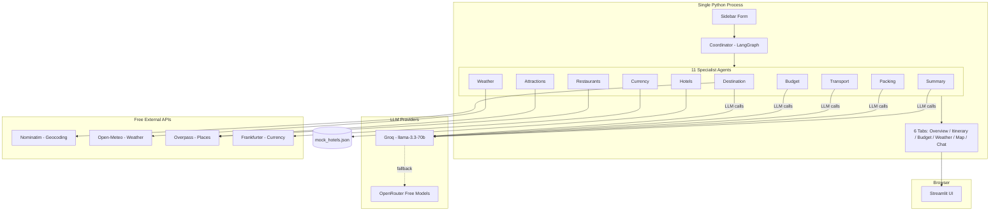

# ✈️ AI Travel Planner Agent

A multi-agent AI trip planner that generates a full, personalized itinerary — destinations, weather, attractions, restaurants, hotels, budget, transport, packing, and currency guidance — built entirely on **free-tier APIs and LLMs**, orchestrated with **LangGraph**, and served through a custom-themed **Streamlit** UI.

> Give it an origin, a destination (or leave it blank for AI suggestions), your dates, budget, and trip style — it plans the whole trip in one go, degrades gracefully when a data source fails, and never invents places it wasn't given real data for.

---

## 🧠 Why This Project

Most "AI travel planner" demos are a single prompt wrapping a chatbot. This one is a genuine **11-agent system**: each agent has one job, its own tool, its own failure handling, and its own test coverage — coordinated by a LangGraph pipeline that a Streamlit frontend calls end-to-end. It's built to survive real-world free-tier conditions: rate limits, flaky public APIs, and LLMs that occasionally hallucinate — and to be honest with the user when something couldn't be fetched, instead of quietly making it up.

---

## 🏗️ Architecture



The Coordinator runs a **mostly-linear pipeline**: destination → weather → attractions → restaurants → hotels → budget → transport → packing → currency → **summary (always runs last)**. Every agent catches its own failures and logs them to a shared `errors` list rather than crashing the run — the Summary Agent checks that list and honestly labels any degraded section instead of hiding the gap.

---

## 🤖 The 11 Agents

| Agent | Responsibility | Data Source |
|---|---|---|
| **Coordinator** | Runs the pipeline, handles partial failures | LangGraph `StateGraph` |
| **Destination** | Suggests or validates the destination | LLM + Nominatim |
| **Weather** | Forecast or climate-normal estimate | Open-Meteo |
| **Attraction** | Sights/landmarks ranked to user preferences | Overpass + LLM ranking |
| **Restaurant** | Food recommendations, dietary-aware | Overpass + LLM ranking |
| **Hotel** | Lodging suggestions across budget tiers | Curated mock dataset (4 cities), LLM-generated fallback for others |
| **Budget** | Category-split cost estimate, validated to sum exactly | LLM + Python-side rescale |
| **Transport** | Local transit, taxis, walkability, airport transfer | LLM (general knowledge) |
| **Packing** | Weather- and trip-type-aware checklist | LLM |
| **Currency** | Local currency conversion + cash-handling tips | Frankfurter API |
| **Summary** | Synthesizes everything into a day-by-day itinerary | LLM, constrained to a **closed list** of real places |

---

## ✨ Features

- 🌍 **AI destination suggestions** or user-specified destination
- 📅 **Day-by-day itinerary** generation with morning/afternoon/evening blocks
- 💰 **Budget planning** — category breakdown, validated to sum exactly to the target
- 🌦️ **Weather forecast** (with honest "estimate" labeling for trips too far out for a live forecast)
- 🎒 **Packing checklist**, categorized and weather-aware
- 🏛️ **Attraction & restaurant recommendations**, filtered to trip preferences
- 🏨 **Hotel suggestions** across budget tiers (clearly labeled mock data)
- 💱 **Currency conversion** with live exchange rates
- 🚌 **Local transport guide**
- 🗺️ **Interactive map** with color-coded pins (attractions, restaurants, hotels)
- 💬 **AI chat assistant** — ask questions about the generated trip
- 📄 **PDF export** — Unicode-safe, handles non-Latin destination/place names
- 🔗 **"Search & Book" links** — real one-click hand-off to Google Flights / Booking.com (search only, no in-app payment processing)
- 🔁 **Regenerate Itinerary** — re-run without refilling the form

---

## 🛡️ Reliability, Not Just a Demo

This project was built and stress-tested against real free-tier failure conditions, not just the happy path:

- **Rate-limit resilience** — Nominatim's 1 req/sec limit is enforced in code; Overpass gets 3-attempt exponential backoff; Groq's daily/per-minute limits automatically fall back to OpenRouter free models.
- **Graceful degradation** — if an API fails after retries, the affected agent returns a safe default and logs it to `state["errors"]` — the pipeline never crashes, and the UI honestly surfaces what's missing instead of hiding it.
- **Anti-hallucination guardrail** — the Summary Agent is prompted with a **closed list** of real attractions/restaurants and explicitly forbidden from naming anything else (even famous landmarks it knows from training data). A Python-side validator then cross-checks the generated itinerary text against the real data and flags anything unexpected — confirmed in testing to catch invented places like "Eiffel Tower" or "Jim Thompson House" when they weren't part of the actual fetched data, while correctly ignoring false positives.
- **JSON parsing retries** — every agent that parses structured LLM output retries once with a stricter formatting instruction before falling back to a safe default, rather than letting a raw parser exception leak into the app.

---

## 🧰 Tech Stack

| Layer | Choice |
|---|---|
| Frontend | Streamlit (custom themed) |
| Backend | Python 3.12 |
| Orchestration | LangGraph |
| LLM | Groq (`llama-3.3-70b-versatile`) primary, OpenRouter free models fallback |
| Maps | OpenStreetMap via Folium |
| Geocoding | Nominatim |
| Weather | Open-Meteo |
| Places | Overpass API |
| Currency | Frankfurter API |
| Charts | Plotly |
| PDF Export | fpdf2 (Unicode-safe fonts) |
| State | Streamlit `st.session_state` (no database — see below) |

**100% free tier.** No paid API keys required anywhere in this stack.

---

## 🚀 Getting Started

### Prerequisites
- Python 3.12
- A free [Groq](https://console.groq.com) API key
- A free [OpenRouter](https://openrouter.ai) API key (fallback provider)

### Setup

```bash
git clone https://github.com/<your-username>/travel-planner-agent.git
cd travel-planner-agent

python -m venv venv
venv\Scripts\activate          # Windows
# source venv/bin/activate     # macOS/Linux

pip install -r requirements.txt
```

Copy `.env.example` to `.env` and add your keys:

```
GROQ_API_KEY=your_actual_key_here
OPENROUTER_API_KEY=your_actual_key_here
```

Run it:

```bash
python -m streamlit run app/streamlit_app.py
```

---

## 📁 Project Structure

```
travel-planner-agent/
  app/
    llm/factory.py              # Groq primary + OpenRouter fallback
    agents/                     # 11 agents + shared TripState + Coordinator
    tools/                      # Geocoding, weather, places, currency, PDF, booking links
    data/mock_hotels.json       # Curated hotel dataset (Jaipur, Paris, Bangkok, Tokyo)
    ui/
      sidebar.py
      theme.py                  # Custom CSS theming
      tabs/                     # Overview, Itinerary, Budget, Weather, Map, Chat
    streamlit_app.py            # Entrypoint
  coordinator_test.py           # CLI harness — runs the full pipeline without the UI
```

---

## ⚠️ Known Free-Tier Limitations

| Limitation | Mitigation |
|---|---|
| Weather forecasts are only reliable ~16 days out | Falls back to labeled climate-normal "estimates" beyond that |
| Hotel/flight data isn't live inventory | Clearly labeled mock/LLM-generated data; real booking links hand off to Booking.com / Google Flights |
| Overpass (places) can be slow or return 504s | Retry with exponential backoff, graceful empty-state handling |
| No real-time visa/safety data | Static, disclaimed reference data only |
| Groq free tier has daily token limits | Automatic OpenRouter fallback |
| No persistence across sessions | Architecture leaves a clean seam for Supabase (see below) |

---

## 🔮 Production Upgrade Path

- Swap in-memory cache → Redis/disk-backed with real invalidation
- Swap mock hotel/flight data → Amadeus Self-Service API (genuine free tier)
- Add Supabase for persistence, auth, and trip history — `TripState` is already a flat, serializable schema that maps directly onto a `trips` table
- Move agent execution behind a FastAPI backend so the UI and orchestration scale independently
- Parallelize independent branches of the Coordinator graph (weather/attractions/restaurants/hotels can run concurrently once the destination is resolved)

---

## 🧪 Testing

```bash
# Full pipeline, no UI — fastest way to verify all 11 agents end-to-end
python coordinator_test.py

# Individual tool/agent checks
python -m pytest tests/
```

---

## 📄 License

MIT — see [LICENSE](LICENSE) for details.

---

## 🙋 About

Built as a portfolio project to demonstrate practical multi-agent orchestration with LangGraph — real failure handling, real hallucination mitigation, and a genuinely usable UI, all running on infrastructure that costs nothing to operate.